# Architecture Document for Tier 1 Personal Firewall

## System Overview
The AI-Powered Stateful Personal Firewall is a Python-based security tool designed to monitor, filter, and inspect network traffic in real-time. It implements a stateful inspection engine, an Intrusion Detection System (IDS), Machine Learning Anomaly Detection, Threat Intelligence, a highly-concurrent database logging pipeline, and a modern React-based administrative dashboard.

## Core Components
### 1. PacketCapture (`packet_capture.py`)
Uses `scapy` to sniff packets asynchronously. Extracts L3 and L4 headers (IP, TCP, UDP, ICMP), standardizes them into a robust `Packet` dataclass, and passes them to a registered callback.

### 2. ConnectionTracker (`connection_tracker.py`)
Maintains a state table of active connections based on the 5-tuple signature. Implements a partial TCP State Machine handling transitions (`SYN_SENT`, `SYN_RECV`, `ESTABLISHED`, `FIN_WAIT`, `CLOSED`) and tracks ingress/egress bytes. Expiration is managed in a separate thread.

### 3. RuleEngine (`rule_engine.py`)
A prioritized evaluation engine that checks packet signatures (source/destination IP, port, protocol, and directional local matching) against JSON-configured rules. Uses exact match, port ranges, CIDR subnets, and `any` wildcards.

### 4. IDSEngine (`ids_engine.py`)
A signature and heuristic-based anomaly detector monitoring for:
- **Port Scans:** High volume of unique ports targeted within 10 seconds.
- **SYN Floods:** High volume of SYNs sent to the same destination without completing handshakes.
- **ICMP Floods:** Massive influx of ping requests.
- **Brute Force Attacks:** Repeated failed connections/SYNs from a single source.
- **Suspicious Ports:** Connections to known risky alternative ports (e.g., 12345).

### 5. Analytics & Threat Intelligence (`analytics/`)
A dedicated module for offline processing:
- **FlowEngine**: Aggregates packets into bidirectional flows, maintaining metadata (duration, bytes in/out, packets in/out).
- **ThreatScoringEngine**: Consolidates heuristic scores from the IDS, anomaly scores from the ML detector, and reputation scores from Threat Intelligence (AlienVault OTX) into a single, combined risk score.
- **Auto-Mitigation**: If the combined risk score exceeds a configurable threshold, the engine automatically injects a temporary `DROP` rule into the `RuleEngine` to halt attacks instantly.

### 6. Machine Learning Detector (`ml/`)
Implements an **Isolation Forest** model to detect Zero-Day anomalies based on traffic patterns rather than signatures.
- Evaluates flows asynchronously based on `bytes_per_second`, `duration`, and `packet size variance`.
- Provides an anomaly score (`-1` to `1`) that feeds into the `ThreatScoringEngine`.

### 7. REST API & WebSockets (`api/`)
A high-performance **FastAPI** application that serves analytics data, manages firewall rules dynamically, and broadcasts live alerts and traffic metrics over WebSockets to the frontend.

### 8. React Dashboard (`frontend/`)
A modern, dark-themed Single Page Application built with **Vite, React, and Tailwind CSS**.
- Real-time charts via **Recharts**.
- Dynamic DataTables for Connections and Rules.
- WebSocket-driven Alert feeds.

### 9. Logging, Metrics, and Database
All events, alerts, and captured packets are asynchronously written to a SQLite database by the `DBWriter` background thread. The database schema is strictly version-controlled using **Alembic**.
A structured JSON file log natively rotates daily.
**Prometheus** metrics are exposed via `/metrics`, tracking queue depth, threading health, and connections.

## Sequence Diagram: Packet Processing Flow

```mermaid
sequenceDiagram
    participant Net as Network Interface
    participant PC as PacketCapture
    participant Core as PersonalFirewall
    participant TR as ConnectionTracker
    participant RE as RuleEngine
    participant IDS as IDSEngine
    participant Flow as FlowEngine
    participant ML as ML Detector
    participant Score as ThreatScoring
    participant API as FastAPI
    participant UI as React Dashboard

    Net->>PC: Raw Packet
    PC->>Core: Normalized Packet Object
    Core->>TR: Update Connection State
    Core->>RE: Evaluate Rules
    RE-->>Core: Action (Allow/Block/Drop)
    Core->>IDS: Analyze Anomalies
    IDS-->>Core: Heuristic Alerts
    Core->>Flow: Update Traffic Flows
    
    rect rgb(30, 30, 50)
        note right of Flow: Asynchronous Pipeline
        Flow->>ML: Evaluate Flow Anomalies
        Flow->>Score: Combine Scores (IDS + ML + TI)
        Score-->>RE: Auto-Mitigation (Inject DROP Rule)
    end
    
    alt If Action == Block
        Core->>Net: Send TCP RST / ICMP Unreachable
    end
    
    Core-->>API: Broadcast via WebSockets
    API-->>UI: Real-Time Alert / Event
```

## Data Flow Pipeline
1. `scapy.sniff` captures a packet on the network interface.
2. `PacketCapture` normalizes the raw data into a `Packet` object.
3. `PersonalFirewall` (Orchestrator) receives the `Packet`.
4. `ConnectionTracker` updates TCP state and byte counts.
5. `RuleEngine` evaluates the packet. If action is `block`, Scapy actively forges and sends a TCP RST or ICMP Port Unreachable packet.
6. `IDSEngine` assesses the packet context for signatures and generates `Alert` records if thresholds are breached.
7. `Database` & `JSON Logger` persists the evaluation results and logs.

## Known Limitations
- Sending raw packets (`scapy.send()`) for `block` actions requires elevated administrative privileges and may conflict with the host OS's native TCP/IP stack (especially on Windows).
- Passive listening (without NFQUEUE or iptables) means the firewall cannot drop packets before they reach the OS layer. It can only send resets after the fact.
- `scapy` packet capture is inherently CPU-bound and struggles with >10,000 packets per second in Python.
