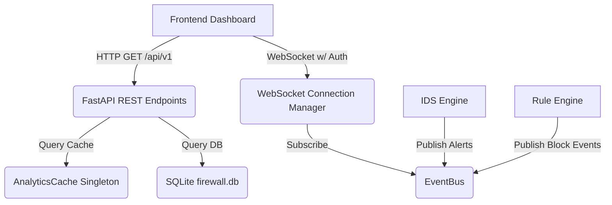
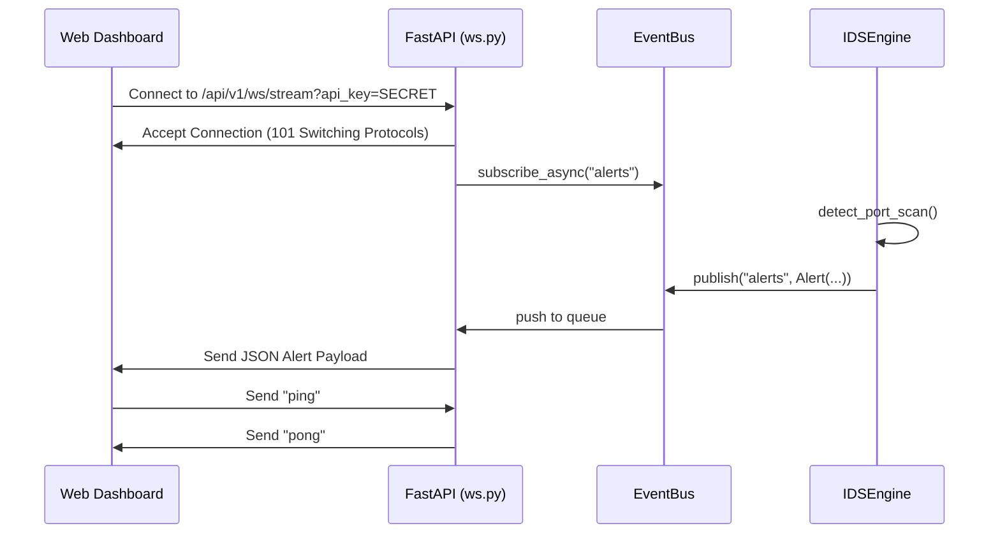

# Phase 2B API Documentation

This document serves as the formal specification and deployment guide for the Phase 2B API layer.

## Architecture Diagram



## Security & Rate Limiting
- **Authentication**: All endpoints require a static API Key. Pass it via the `X-API-Key` HTTP header or `?api_key=` query parameter.
- **Rate Limiting**: Protected by `slowapi` (default: 100 requests per minute per IP).

## WebSocket Message Schema

Clients connected to `ws://HOST:PORT/api/v1/ws/stream?api_key=...` will receive JSON payloads structured as follows:

### Alert Payload
```json
{
  "topic": "alert",
  "data": {
    "timestamp": "2026-06-25T14:30:00Z",
    "alert_type": "syn_flood",
    "severity": "critical",
    "src_ip": "192.168.1.100",
    "dst_ip": "10.0.0.1",
    "description": "SYN flood detected",
    "action_taken": "log"
  }
}
```

### Event Payload
```json
{
  "topic": "event",
  "data": {
    "timestamp": "2026-06-25T14:30:05Z",
    "rule_id": "block_all_ssh",
    "action": "block",
    "src_ip": "192.168.1.50",
    "src_port": 54321,
    "dst_ip": "10.0.0.1",
    "dst_port": 22,
    "protocol": "TCP",
    "reason": "Block SSH"
  }
}
```

## Sequence Diagram: Real-Time Event Streaming



## Deployment Guide

1. **Configuration**: Copy `.env.example` to `.env` and fill in your `API_KEY`.
2. **Dependencies**: `pip install -r requirements.txt`
3. **Execution**: Run the unified backend using `python -m firewall.cli start-api --host 0.0.0.0 --port 8000`

## API Usage Examples

### Python `requests`
```python
import requests

headers = {"X-API-Key": "my_super_secret_api_key_123"}
response = requests.get("http://localhost:8000/api/v1/stats", headers=headers)
print(response.json())
```

### cURL
```bash
curl -H "X-API-Key: my_super_secret_api_key_123" http://localhost:8000/api/v1/alerts?limit=10
```

## Graceful Shutdown
Upon receiving `SIGINT` (Ctrl+C) or `SIGTERM`, FastAPI triggers its `lifespan` context manager which safely completes the following sequence:
1. Cancels the background WebSocket broadcasting task.
2. Closes active WebSocket clients cleanly.
3. Stops the packet capture thread (`fw_instance.stop()`).
4. Flushes remaining events in the `DBWriter` buffer to SQLite.
5. Safely terminates the Uvicorn workers.
